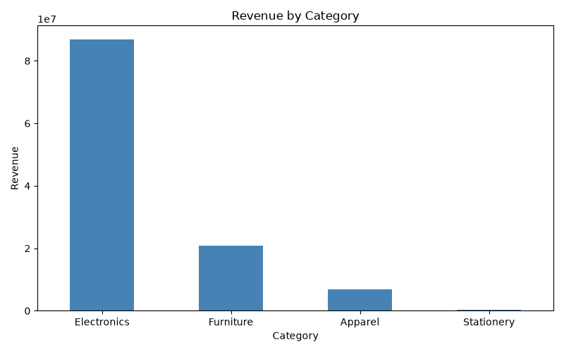
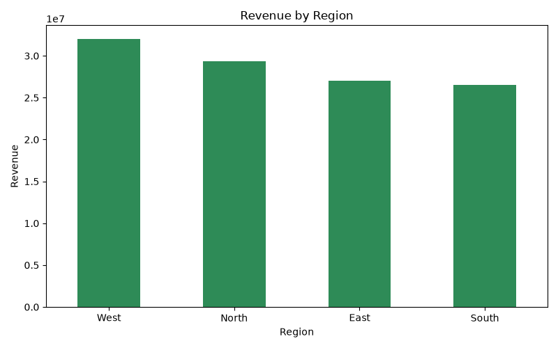
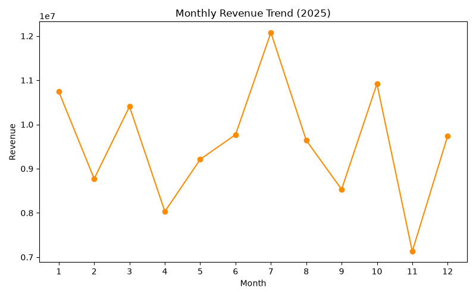

# Sales Data Analysis

A Python project that generates a synthetic sales dataset (2000 orders), analyzes it with pandas, and visualizes the results with matplotlib.

## Project Structure

- data/src/generate_dataset.py : generates the dataset
- data/src/analyze_sales.py : revenue by category, region, product and payment mode
- data/src/make_charts.py : creates charts
- output/sales_data.csv : generated dataset
- output/charts/ : saved charts

## How to Run

    pip install numpy pandas matplotlib
    python data/src/generate_dataset.py
    python data/src/analyze_sales.py
    python data/src/make_charts.py

## Charts

## Tools Used

Python, pandas, NumPy, matplotlib